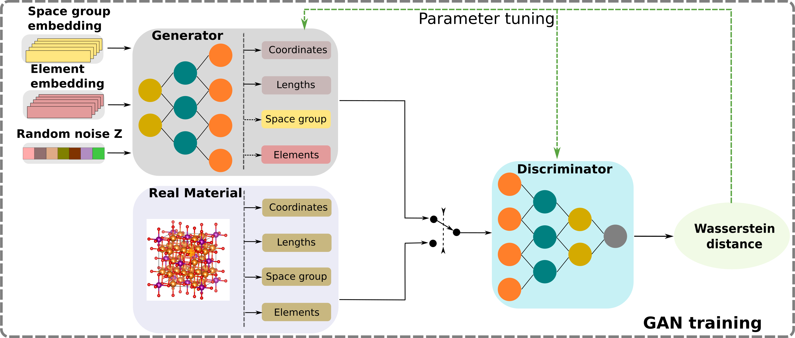

# CubicGAN:

### HIGH-THROUGHPUT DISCOVERY OF CUBIC CRYSTAL MATERIALS USING DEEP GENERATIVE NEURAL NETWORKS



Created by Yong Zhao

## Introduction

This repository contains the implementation of CubicGAN. You can visit [Carolina Materials Database](http://www.carolinamatdb.org/) for more info.

## Prerequisite 
python 3.7  
tensorflow-gpu==2.2.0  
pymatgen==2020.3.13  
numpy==1.16.4  
pandas==0.25.1  
scikit-learn==0.23.1  

we recommend that you build a virtural environment running the code.

## How to use the code

### Step 1
Once you download the code to your machine, you need to make three folders to the project root directory. The three folders are `logs`, `models`, and `generated_mat`. The folder `logs` saves training loss of discriminator and generator. The folder `models` saves trained models. The folder `generated_mat` saves your generated materials information. We keep 100 cleaned CIFs in folder `data/trn-cifs/`, you can use them for trying this code. Just calling "python chain.py" can let you experience whole process. If you want to build your own training work, you might need below steps.

### Step 2
Before you start to run the code, you have to collect the training data by yourself from open databases (e.g., [OQMD](http://oqmd.org/download/)). You have to be sure that you convert the downloaded crystal strucutes to symmetrized CIFs and select materials only with atom position of multiplicative factor of 0.25. Then, you can replace the given CIFs in folder `data/trn-cifs/` and run 
```bash
python extract_crystal.py
``` 

Note: We recommend that you change the space group ratio in [util.py](https://github.com/MilesZhao/CubicGAN/blob/e495401a7fd1b04e47a226ed95b7ef9d329c055c/util.py#L48) if you want your generated mateirals to follow the similar space group ratio as training data.

### Step 3
Train the generator model by runing

```bash
python wgan-v2.py
``` 

The model will be saved in the folder `models`.

### Step 4
Generate materials by runing 
```bash
python generate_crystal.py --n_samples=1000
``` 

Argument `n_samples` controls how many number you will generate and the data will be saved under directory `generated_mat/sample-1000`.

### Step 5
Runing 
```bash
python pymatgen_valid.py --n_samples=1000
``` 
will generate two folders under directory `generated_mat/sample-1000`. The folder `tmp-charge-cifs` saves the valid CIFs recognized by pymatgen. The folder `tmp-charge-cifs` saves the crystal structures with zero charge. 

### Step 6
For further analysis, run 
```bash
python build_repeating_cifs_stru.py --n_samples=1000
``` 
and 
```bash
python build_unique_records.py --n_samples=1000
```  
which build a tree structure for repeating CIFs and unique CIFs csv file under directory `generated_mat/sample-1000`.

## Training data used in our work

In file [oqmd-dat.csv](https://github.com/MilesZhao/CubicGAN/blob/main/data/oqmd-dat.csv), we show the IDs and other information of materials in OQMD.

|Total|Fm-3m|F-43m|Pm-3m|unique formula|
| :--- | :---: | :---: | :---: | :---: |
|375749|186344|184162|5243|249646|


